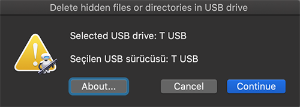
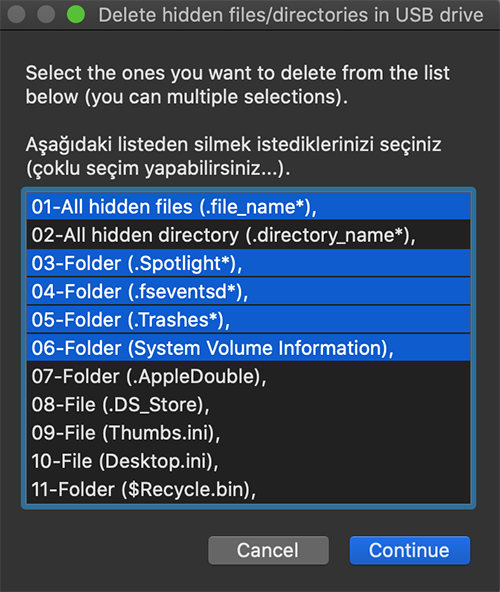
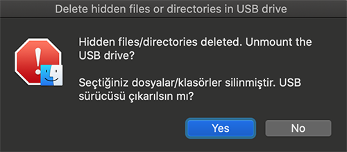

# Delete hidden files or directories
This script is used to delete hidden files or directories in USB drives.
 
Bu script, MAC işletim sisteminde, her bir dosya için oluşturulan meta dosyalarını (.dosya_adı) silmek amacıyla hazırlanmış bir applescripttir.
 
MAC işletim sisteminde bir dosyayı USB sürücüye kopyalayıp, bu USB sürücüyü Windows işletim sisteminde açtığınız zaman, her bir dosyanın yanında **nokta (.)** ile başlayan aynı isimde bir dosya daha olduğunu göreceksiniz. Özellikle MP3 oynatıcılarda bu gizli dosyalar sorun oluşturabilmektedir. Bu dosyaları tek tek silmek yerine applescript ile toplu olarak silebilirsiniz. Ayrıca bu script dosyasını Apple >> Automator programı yardımıyla uygulama haline getirip MAC işletim sisteminde kullanabilirsiniz. Veya uygulama haline getirilmiş <a href="./DeleteHiddenFilesDirectories.zip">**DeleteHiddenFilesDirectories.zip**</a> dosyasındaki **DeleteHiddenFilesDirectories.app** uygulama dosyasını bilgisayarınıza indirip direk çalıştırabilirsiniz. Ayrıca bu script ile **nokta (.)** ile başlayan bu meta dosyaları dışında, diğer gizli dosya ve klasörleri de silebilirsiniz.

Bu script'i kendi işimi görmek için hızlıca hazırladığımdan dolayı kodlar tam olarak optimize edilmemiştir. Fakat sorunsuz çalışmaktadır.

Bu uygulama ile silebileceğiniz dosya veya klasör seçenekleri:  
1-All hidden files (.file_name*) : Tüm gizli dosyaları silecektir.  
2-All hidden directory (.directory_name*) : Tüm gizli olan klasörleri silecektir.  
3-Folder (.Spotlight*) : Spotlight ile başlayan gizli klasör silinecektir.  
4-Folder (.fseventsd*) : fseventsd ile başlayan gizli klasör silinecektir.  
5-Folder (.Trashes*) : Trashes gizli klasörü silinecektir.  
6-Folder (System Volume Information) : System Volume Information klasörü silinecektir.  
7-Folder (.AppleDouble) : AppleDouble gizli klasörü silinecektir.  
8-File (.DS_Store) : DS_Store gizli dosyası silinecektir.  
9-File (Thumbs.ini) : Thumbs.ini dosyası silinecektir.  
10-File (Desktop.ini) : Desktop.ini dosyası silinecektir.  
11-Folder ($Recycle.bin) : Recycle.bin geri dönüşüm klasörü silinecektir.  

**DeleteHiddenFilesDirectories.app** ekran görüntüleri:

  

  

  

